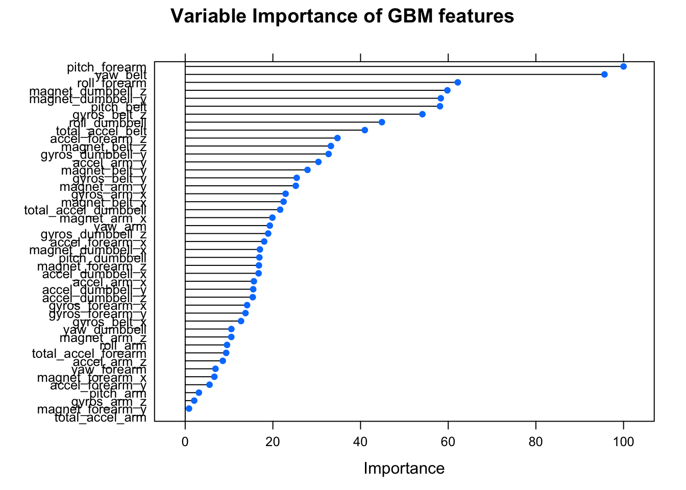

# HAR DATA prediction exercise using parsimonious GBM
Edwin Seah  
23 Jul 2015  


### Executive Summary

The HAR dataset comprises Human Activity Recognition data regarding a series of five weighlifting activities performed by six research subjects. The project goal is to predict the activity performed, denoted by the **classe** variable, using a simple machine learning algorithm based on the recorded measurements. The approach aims to favour simplicity (fewer features) over maximizing marginal accuracy improvements, and makes use of the *caret* package extensively.

### Getting/Transforming Data and some Exploratory Data Analysis  

Based on the documentation, our desired target/response variable **classe** is a factor of 5 levels with values A to E, which implores us to consider this as a classification problem. Since there are 160 columns/variables to pick features from, prior to creating our training/validation sets from the given [training data](https://d396qusza40orc.cloudfront.net/predmachlearn/pml-training.csv), we will prune it of irrelevant features and those that have conceivably negligible contributions to the predictive power of our model. The transformation includes the following steps, carried out in order:

+ We load in the data as follows and normalize the NA values:

```r
# Downloads the training and testing data
download.file("https://d396qusza40orc.cloudfront.net/predmachlearn/pml-training.csv", method = "curl", destfile = "pml-training.csv")
download.file("https://d396qusza40orc.cloudfront.net/predmachlearn/pml-testing.csv", method = "curl", destfile = "pml-testing.csv")
# Loading and normalizing NA strings
df.train <- read.csv("pml-training.csv", header=TRUE, sep=",", na.strings=c("NA", "#DIV/0!"))
df.test <- read.csv("pml-testing.csv", header=TRUE, sep=",", na.strings=c("NA", "#DIV/0!"))
```
+ Cursory observation of the dataset had revealed the first seven columns are identity and timestamp related. These would have no actual predictive value
as they are not measurements for physical activity, and are thus removed. 

```r
# Removal of 7 irrelevant id variables
col_idvar <- c("X", "user_name", "raw_timestamp_part_1", "raw_timestamp_part_2", "cvtd_timestamp", "new_window", "num_window")
df.train <- df.train [, ! names(df.train) %in% col_idvar, drop = FALSE]
```
+ Many values are observed to be "#DIV/0!" strings. Since the latter are derived from the actual measurements values using MS Excel worksheet formula functions (eg. for 12 "skewness" and 12 "kurtosis" variables describing the distribution of features rather than the features directly), as they are not primary sensor data, and thus would interfere with feature selection.

```r
# Removal of 24 MS Excel generated columns for skewness and kurtosis
col_excel <- grep(x=names(df.train), pattern="skewness|kurtosis")
df.train <- df.train[,-col_excel]
```
+ Many variables are observed to have a high proportion of "NA" values. Since this is a classification task, NA values contribute little, if any, information gain for each tree split and only serve to increase computational expense and also cause issues for some models in caret. Those columns that are over our threshold of 90% NA values are dropped.

```r
# Removal of variables composed of greater than 90% NA values
df.train[colMeans(is.na(df.train))>0.9] <- list(NULL)
```
+ Variables that have a higher than 90% correlation with another within the dataset are also removed, on the premise that because of this high correlation, simply using one of each pair of correlated variables will capture a large amount of variability in the response variable (hopefully!).

```r
library(caret)
# Removal of highly correlated variables using cor()
correlated <- findCorrelation(cor(df.train[-dim(df.train)]), cutoff=0.9)
df.train <- df.train[,-correlated]
```
+ Use of the nearZeroVar function from *caret* indicated that there was nothing left to cull since there were no variables left that exhibit the two characteristics worth reducing (either too few unique values or variance in values).

```r
# Removal of variables with near zer
zVal <- nearZeroVar(df.train, saveMetrics=TRUE) # for metrics
print(zVal)
```

```
##                      freqRatio percentUnique zeroVar   nzv
## pitch_belt            1.036082     9.3772296   FALSE FALSE
## yaw_belt              1.058480     9.9734991   FALSE FALSE
## total_accel_belt      1.063160     0.1477933   FALSE FALSE
## gyros_belt_x          1.058651     0.7134849   FALSE FALSE
## gyros_belt_y          1.144000     0.3516461   FALSE FALSE
## gyros_belt_z          1.066214     0.8612782   FALSE FALSE
## magnet_belt_x         1.090141     1.6664968   FALSE FALSE
## magnet_belt_y         1.099688     1.5187035   FALSE FALSE
## magnet_belt_z         1.006369     2.3290184   FALSE FALSE
## roll_arm             52.338462    13.5256345   FALSE FALSE
## pitch_arm            87.256410    15.7323412   FALSE FALSE
## yaw_arm              33.029126    14.6570176   FALSE FALSE
## total_accel_arm       1.024526     0.3363572   FALSE FALSE
## gyros_arm_x           1.015504     3.2769341   FALSE FALSE
## gyros_arm_z           1.110687     1.2638875   FALSE FALSE
## accel_arm_x           1.017341     3.9598410   FALSE FALSE
## accel_arm_y           1.140187     2.7367241   FALSE FALSE
## accel_arm_z           1.128000     4.0362858   FALSE FALSE
## magnet_arm_x          1.000000     6.8239731   FALSE FALSE
## magnet_arm_y          1.056818     4.4439914   FALSE FALSE
## magnet_arm_z          1.036364     6.4468454   FALSE FALSE
## roll_dumbbell         1.022388    84.2065029   FALSE FALSE
## pitch_dumbbell        2.277372    81.7449801   FALSE FALSE
## yaw_dumbbell          1.132231    83.4828254   FALSE FALSE
## total_accel_dumbbell  1.072634     0.2191418   FALSE FALSE
## gyros_dumbbell_y      1.264957     1.4167771   FALSE FALSE
## gyros_dumbbell_z      1.060100     1.0498420   FALSE FALSE
## accel_dumbbell_x      1.018018     2.1659362   FALSE FALSE
## accel_dumbbell_y      1.053061     2.3748853   FALSE FALSE
## accel_dumbbell_z      1.133333     2.0894914   FALSE FALSE
## magnet_dumbbell_x     1.098266     5.7486495   FALSE FALSE
## magnet_dumbbell_y     1.197740     4.3012945   FALSE FALSE
## magnet_dumbbell_z     1.020833     3.4451126   FALSE FALSE
## roll_forearm         11.589286    11.0895933   FALSE FALSE
## pitch_forearm        65.983051    14.8557741   FALSE FALSE
## yaw_forearm          15.322835    10.1467740   FALSE FALSE
## total_accel_forearm   1.128928     0.3567424   FALSE FALSE
## gyros_forearm_x       1.059273     1.5187035   FALSE FALSE
## gyros_forearm_y       1.036554     3.7763735   FALSE FALSE
## accel_forearm_x       1.126437     4.0464784   FALSE FALSE
## accel_forearm_y       1.059406     5.1116094   FALSE FALSE
## accel_forearm_z       1.006250     2.9558659   FALSE FALSE
## magnet_forearm_x      1.012346     7.7667924   FALSE FALSE
## magnet_forearm_y      1.246914     9.5403119   FALSE FALSE
## magnet_forearm_z      1.000000     8.5771073   FALSE FALSE
## classe                1.469581     0.0254816   FALSE FALSE
```
+ Our training and testing sets are then allocated as 70/30 from the training data given.

```r
trainIndex <- createDataPartition(df.train$classe, p=0.7, list=FALSE)
training <- df.train[trainIndex,]
testing <- df.train[-trainIndex,]
```
Our training/testing sets thus consist of a shortlist of 46 predictors, split into 13737 (training) and 5885 (testing) rows.

### Building preliminary decision tree to investigate the data set

Instead of directly training a model from the training set, we use a small subsample from the training set to investigate if heretofore unobserved characteristics of the dataset would favour or hinder various model types. They can also be used to cut down on the number of features in the final model, by checking each features' importance relative to the next. We set a seed from this point on to ensure reproducibility.

```r
# Sets a seed
set.seed(55455)
# Using smaller subsample of 10% of the training data
subIndex1 <- createDataPartition(training$classe, p=0.1, list=FALSE)
sub1 <- training[subIndex1,]
trainingFinal <- training[-subIndex1,]
# Further split subsample into two parts for training/testing subsamples
subIndex2 <- createDataPartition(sub1$classe, p=0.5, list=FALSE)
sub2 <- sub1[-subIndex2,]
sub1 <- sub1[subIndex2,]
```
Using the subsamples we created, we build a basic classification tree to get a feel for the baseline accuracy, and perform 10 cross-validations on the model.

```r
library(rpart)
# Setting xval=10 to perform 5 cross-validations
modRpart <- train(classe~., method="rpart", control=rpart.control(xval=5, minsplit=15, minbucket=5, cp=0.01, maxdepth=15), data=sub1)
#rpart(classe~., data=sub1, control=rpart.control(minsplit=30, minbucket=10, cp=0.01, maxdepth=10))
confusionMatrix(sub2$classe, predict(modRpart, sub2))
```

```
## Confusion Matrix and Statistics
## 
##           Reference
## Prediction   A   B   C   D   E
##          A 153   2  38   1   1
##          B  40  59  24   5   5
##          C   9   2 103   0   6
##          D  34   6  29  24  20
##          E  25  25  27   8  41
## 
## Overall Statistics
##                                           
##                Accuracy : 0.5531          
##                  95% CI : (0.5151, 0.5907)
##     No Information Rate : 0.3799          
##     P-Value [Acc > NIR] : < 2.2e-16       
##                                           
##                   Kappa : 0.4277          
##  Mcnemar's Test P-Value : < 2.2e-16       
## 
## Statistics by Class:
## 
##                      Class: A Class: B Class: C Class: D Class: E
## Sensitivity            0.5862  0.62766   0.4661  0.63158  0.56164
## Specificity            0.9014  0.87521   0.9635  0.86287  0.86156
## Pos Pred Value         0.7846  0.44361   0.8583  0.21239  0.32540
## Neg Pred Value         0.7805  0.93682   0.7919  0.97561  0.94296
## Prevalence             0.3799  0.13683   0.3217  0.05531  0.10626
## Detection Rate         0.2227  0.08588   0.1499  0.03493  0.05968
## Detection Prevalence   0.2838  0.19360   0.1747  0.16448  0.18341
## Balanced Accuracy      0.7438  0.75144   0.7148  0.74722  0.71160
```
Our confusion matrix shows this model to have an accuracy not much better than a coin flip, even when allowing for relatively small splits/branches and a small complexity parameter of 0.01.

### Using a gradient boosted model to check variable importance

We proceed to use a different boosting model in order to improve on our decision tree. Using **gbm** we can check variable importance relative to other predictors out of the box. We do this along with 3-fold cross-validation (not too many to reduce chance of overfitting).

```r
library(gbm); library(survival); library(splines)
library(plyr); library(parallel)
fitControl <- trainControl(## 3-fold CV
                           method = "repeatedcv",
                           number = 3,
                           ## repeated 3 times
                           repeats = 3)
modGBM <- train(classe~., method="gbm", data=sub1, trControl=fitControl, verbose=FALSE)
confusionMatrix(sub2$classe, predict(modGBM, sub2))
```

```
## Confusion Matrix and Statistics
## 
##           Reference
## Prediction   A   B   C   D   E
##          A 181   4   6   3   1
##          B  10  93  17   4   9
##          C   1   5 111   2   1
##          D   4   0  12  96   1
##          E   2  13   4   6 101
## 
## Overall Statistics
##                                          
##                Accuracy : 0.8472         
##                  95% CI : (0.818, 0.8733)
##     No Information Rate : 0.2882         
##     P-Value [Acc > NIR] : < 2.2e-16      
##                                          
##                   Kappa : 0.8068         
##  Mcnemar's Test P-Value : 0.0007349      
## 
## Statistics by Class:
## 
##                      Class: A Class: B Class: C Class: D Class: E
## Sensitivity            0.9141   0.8087   0.7400   0.8649   0.8938
## Specificity            0.9714   0.9301   0.9832   0.9705   0.9564
## Pos Pred Value         0.9282   0.6992   0.9250   0.8496   0.8016
## Neg Pred Value         0.9654   0.9603   0.9312   0.9739   0.9786
## Prevalence             0.2882   0.1674   0.2183   0.1616   0.1645
## Detection Rate         0.2635   0.1354   0.1616   0.1397   0.1470
## Detection Prevalence   0.2838   0.1936   0.1747   0.1645   0.1834
## Balanced Accuracy      0.9428   0.8694   0.8616   0.9177   0.9251
```

```r
v <- varImp(modGBM) ; plot(v, main="Variable Importance of GBM features")
```

 

Our plot of the model shows that much of the contribution to prediction is coming from the top few variables, and therefore surmise that we can cull our training data down to make use of even fewer features in the interests of parsimony. 

### Tuning our GBM for parsimony in final model fit

We select for the predictors that have an importance higher than 20, since we observed from the plot above a diminishing contribution beyond that point. Since we had used only a subsample (10% of the training data set) in order to determine the features to be used, we now fit our final model using the remaining 90% of the training data (previously stored as *trainingFinal*).

```r
# Cull using relative importance higher than 20
trainingCulled <- trainingFinal[, v$importance[,1]>=20]
names(trainingCulled[,-dim(trainingCulled)])
```

```
##  [1] "pitch_belt"        "yaw_belt"          "total_accel_belt" 
##  [4] "gyros_belt_x"      "gyros_belt_z"      "magnet_belt_x"    
##  [7] "magnet_belt_y"     "magnet_belt_z"     "gyros_arm_x"      
## [10] "magnet_arm_z"      "roll_dumbbell"     "yaw_dumbbell"     
## [13] "gyros_dumbbell_y"  "accel_dumbbell_x"  "magnet_dumbbell_y"
## [16] "magnet_dumbbell_z" "roll_forearm"      "pitch_forearm"    
## [19] "accel_forearm_x"   "magnet_forearm_z"
```

```r
# Fit our final model with 3-fold cross-validation
modGBMculled <- train(classe~., method="gbm", data=trainingCulled, trControl = fitControl, verbose=FALSE)
prediction <- predict(modGBMculled, testing)
```

### Accuracy and Error
Our model with 20 predictors (minus the target variable itself) can now be used on the testing data that we set aside previously in order to obtain the unbiased out-of-sample error rate. 

```r
confusionMatrix(testing$classe, prediction)
```

```
## Confusion Matrix and Statistics
## 
##           Reference
## Prediction    A    B    C    D    E
##          A 1641   18    9    4    2
##          B   27 1066   35    4    7
##          C    0   37  962   24    3
##          D    2    3   44  903   12
##          E    1   14   23    7 1037
## 
## Overall Statistics
##                                           
##                Accuracy : 0.9531          
##                  95% CI : (0.9474, 0.9584)
##     No Information Rate : 0.2839          
##     P-Value [Acc > NIR] : < 2.2e-16       
##                                           
##                   Kappa : 0.9407          
##  Mcnemar's Test P-Value : 5.855e-05       
## 
## Statistics by Class:
## 
##                      Class: A Class: B Class: C Class: D Class: E
## Sensitivity            0.9820   0.9367   0.8966   0.9586   0.9774
## Specificity            0.9922   0.9846   0.9867   0.9877   0.9907
## Pos Pred Value         0.9803   0.9359   0.9376   0.9367   0.9584
## Neg Pred Value         0.9929   0.9848   0.9772   0.9921   0.9950
## Prevalence             0.2839   0.1934   0.1823   0.1601   0.1803
## Detection Rate         0.2788   0.1811   0.1635   0.1534   0.1762
## Detection Prevalence   0.2845   0.1935   0.1743   0.1638   0.1839
## Balanced Accuracy      0.9871   0.9607   0.9416   0.9731   0.9840
```

```r
errorEst <- sum(prediction != testing$classe)/length(testing$classe)
```
Our estimate of the error rate is 0.0468989. While we could have chosen to try another model (eg. "random forest"), this approach had given a relatively good accuracy and a relatively small number of predictors to use, and serves our parsimonious goal rather well.


### Project Repo and References

+ All files and full code used are available from my [Github Project Repository](https://github.com/slothdev/pmlproj) (https://github.com/slothdev/pmlproj)
+ [Weight Lifting Exercises Dataset](http://groupware.les.inf.puc-rio.br/har)
+ [Training data used](https://d396qusza40orc.cloudfront.net/predmachlearn/pml-training.csv)
+ [Testing Data used](https://d396qusza40orc.cloudfront.net/predmachlearn/pml-testing.csv)
+ Velloso, E.; Bulling, A.; Gellersen, H.; Ugulino, W.; Fuks, H. [Qualitative Activity Recognition of Weight Lifting Exercises](http://groupware.les.inf.puc-rio.br/work.jsf?p1=11201). Proceedings of 4th International Conference in Cooperation with SIGCHI (Augmented Human '13) . Stuttgart, Germany: ACM SIGCHI, 2013.

All rights reserved.  

### END
